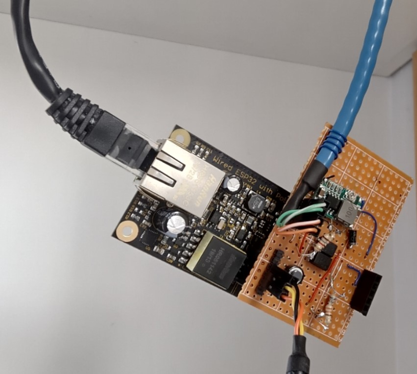
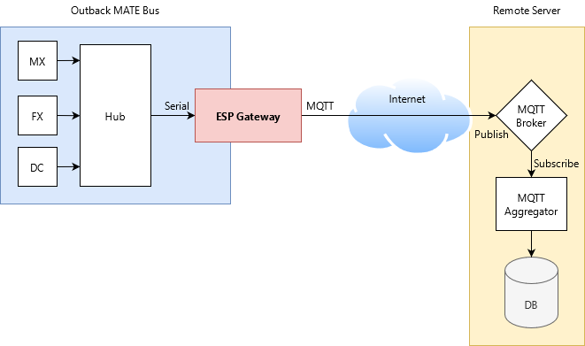
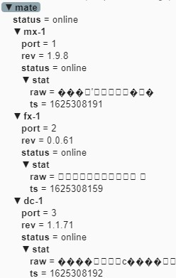
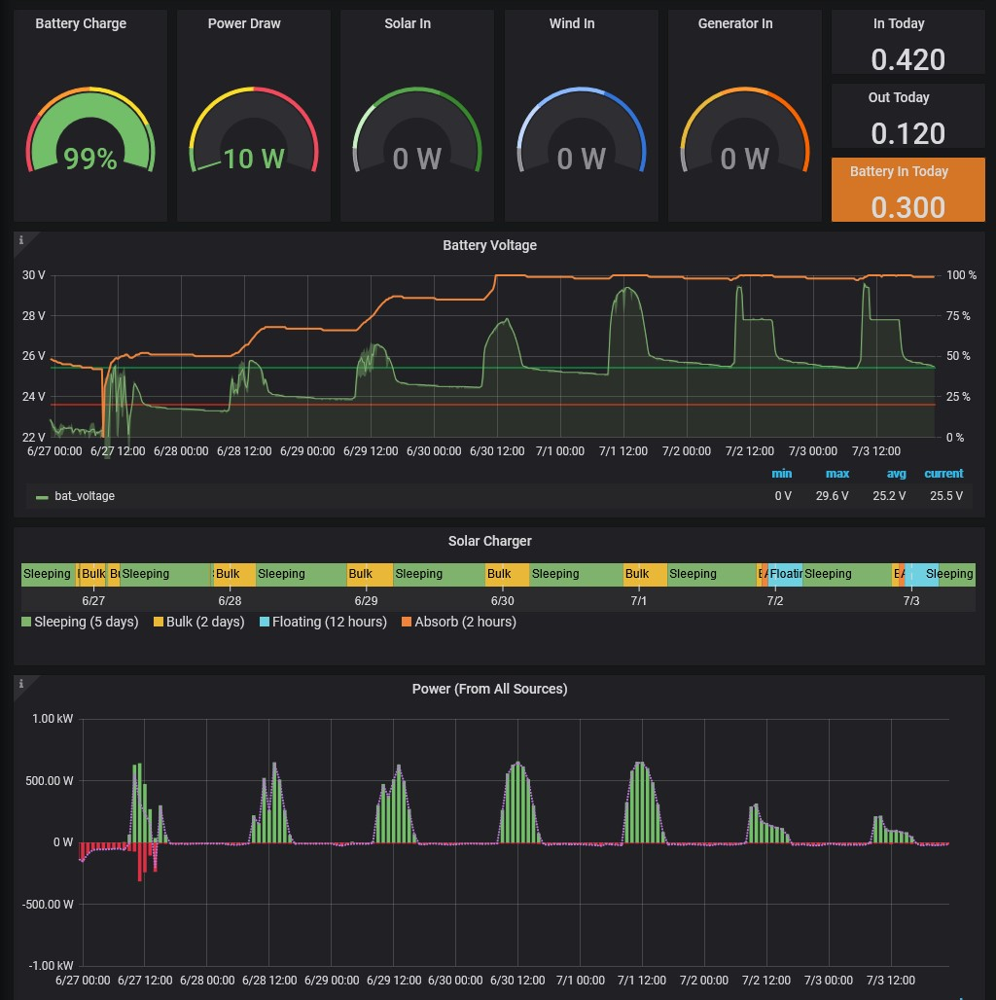

# MATE 2 MQTT Gateway #

This project is a culmination of past work (pyMATE, uMATE) brought together to form a robust and secure method for collecting data from an Outback Solar Power system and transmitting it to a remote server.

While pyMATE worked, it ended up being a bit flakey since PCs don't really like handling 9-bit UART or tight timing on data transmissions. This task is really more suited for a microcontroller, so I settled on the ESP32...



## Architecture ##


The ESP Gateway sits in the middle between the MATE network and the remote MQTT broker (the red box). It's sole function is to relay the raw packets from the MATE network to the remote MQTT server. It does not attempt to decode the packets.



In addition to collecting status/log packets from Outback devices, the gateway also synchronizes devices with the current date/time and battery temperature (mimicing the MATE). This is needed for certain automation functions.

The remote server contains an MQTT broker, a custom aggregator service, and a database (yellow box). The aggregator subscribes to the topics from the gateway, decodes the packets, and stores them into a database.


## Hardware ##

The following hardware has been tested:

- TTGO-T1 Dev Board
- WESP32 (Wired Ethernet ESP32)

Software Serial is used to communicate with the MATE network, and can use most pins on the ESP32.

You will need a simple opto-isolator circuit just like with pyMATE. Make sure your optos are fast enough! (Need <10us rise/fall time)

## Configuration ##

To avoid checking secrets into the repository, secrets must be defined in secrets.json. The first time you try building the project a template secrets.json file will be created, and you will need to fill this in before running the firmware.

```json
{
    "device_name":      "mate",
    "friendly_name":    "MATE Gateway",
    "mqtt_username":    "mate",
    "mqtt_password":    "...",
    "mqtt_server":      "mqtt.my-remote-server.com",
    "mqtt_port":        8883,
    "wifi_ssid":        "Test Network",
    "wifi_pw":          "...",
    "ca_root_cert":     "my-remote-server.crt"
}
```

## Demo ##

Here's my personal Grafana dashboard powered by this gateway:




